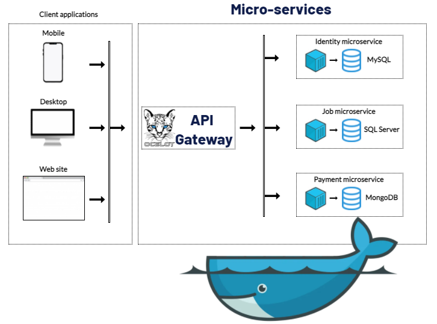

# Jobs
      

Jobs is an open-source job marketplace application, powered by micro-services ☸️ architecture and cross-platform development 📱🖥🐳 based on .NET 5.

## Architecture overview

The architecture proposes a microservice oriented architecture implementation with multiple autonomous microservices (each one owning its own data/db) and has one shared project to work with Repository and Controller for CRUD operations, but implementing different approaches within each microservice using REST/HTTP as the communication protocol between the client apps, and supports asynchronous communication for data updates propagation across multiple services based on gRPC/HTTP2. All microservices are based on SOLID design principles and used popular modern technologies. Also, configured CI/CD pipelines using GitHub Actions for building and testing the code and publishing docker image file to the Docker Hub.

<center></center>

## List of micro-services and infrastructure components

<table>
   <thead>
    <th>№</th>
    <th>Service</th>
    <th>Description</th>
    <th>Build status</th>
    <th>Endpoints</th>
  </thead>
  <tbody>
    <tr>
        <td align="center">1.</td>
        <td>API Gateway (Ocelot)</td>
        <td>This service is responsible for all other micro-services</td>
        <td></td>
        <td></td>
    </tr>
    <tr>
        <td align="center">2.</td>
        <td>Identity API (JWT Token, NLog logging, FW Core, gRPC, CRUD by MySQL, RabbitMQ, FluentValidation, DTO, AutoMapper, Functionality and Unit testing with MSTest)</td>
        <td>Identity management service</td>
        <td>
            <a href="https://github.com/MirolimMajidov/Jobs/actions?query=workflow%3AIdentity%20service">
                
            </a>
        </td>
        <td align="center"> 
            <a href="https://petstore.swagger.io/?url=https://raw.githubusercontent.com/MirolimMajidov/Jobs/master/src/Services/Identity/Identity.API/Swagger/v1/docs.json">
               APIs
            </a>
       </td>
    </tr>
    <tr>
        <td align="center">3.</td>
        <td>Job API (NLog logging, FW Core, CRUD by SQL Server, RabbitMQ, FluentValidation, DTO, AutoMapper, Unit Testing with NUnit)</td>
        <td>This service is responsible for the main part of the current application. All CRUD operations related to Jobs will be here.</td>
        <td>
            <a href="https://github.com/MirolimMajidov/Jobs/actions?query=workflow%3AJob%20service">
                
            </a>
        </td>
        <td align="center"> 
            <a href="https://petstore.swagger.io/?url=https://raw.githubusercontent.com/MirolimMajidov/Jobs/master/src/Services/Job/Job.API/Swagger/v1/docs.json">
               APIs
            </a>
       </td>
    </tr>
    <tr>
        <td align="center">4.</td>
        <td>Payment API (Serilog logging, Repocitory, CRUD by MongoDB, RabbitMQ, FluentValidation, DTO, AutoMapper, Unit Testing with xTest)</td>
        <td>Responsible for financial and payments</td>
        <td>
            <a href="https://github.com/MirolimMajidov/Jobs/actions?query=workflow%3APayment%20service">
                
            </a>
        </td>
        <td align="center"> 
            <a href="https://petstore.swagger.io/?url=https://raw.githubusercontent.com/MirolimMajidov/Jobs/master/src/Services/Payment/Payment.API/Swagger/v1/docs.json">
               APIs
            </a>
       </td>
    </tr>
  </tbody>  
</table>

Each microservice has its own docker image file with the latest code of master branch on my [Docker Hub](https://hub.docker.com/u/mirolimmajidov/) with :latest tag.

## Getting Started

Make sure you have installed and configured [Docker for Windows](https://docs.docker.com/docker-for-windows/install/) in your machine. After that, you can run the below commands from the the main Jobs directory and get started with the `Jobs` immediately.

```powershell
docker-compose -f docker-compose.yml -f docker-compose.override.yml up -d
```

You should be able to browse different components of the application by using the below URLs :
<ul>
   <li><a href="http://localhost:7000/" rel="nofollow">API Gateway</a></li>
   <li><a href="http://localhost:7001/" rel="nofollow">Identity service</a> | <a href="http://localhost:7101/" rel="nofollow">Identity service for gRPC</a></li>
   <li><a href="http://localhost:7002/" rel="nofollow">Jobs service</a></li>
   <li><a href="http://localhost:7003/" rel="nofollow">Payment service</a></li>
   <li><a href="http://localhost:7014/" rel="nofollow">RabbitMQ Management</a></li>
</ul>
