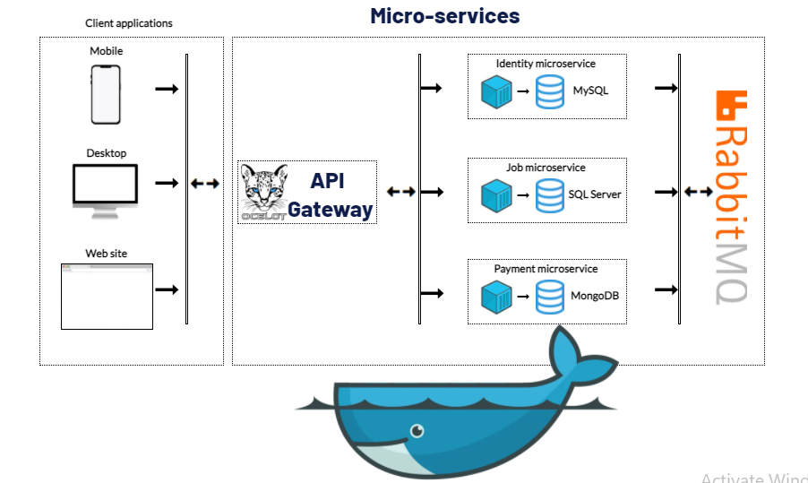

# Jobs
Jobs is a open source work marketplace application, powered by micro-services ☸️ architecture and cross-platform development 📱🖥🐳 based on .NET 5.

## Architecture overview

The architecture proposes a microservice oriented architecture implementation with multiple autonomous microservices (each one owning its own data/db) and has one shared project to work with Repocitory and Controller for CRUD operations, but implementing different approaches within each microservice using REST/HTTP as the communication protocol between the client apps, and supports asynchronous communication for data updates propagation across multiple services based on gRPC/HTTP2.

<center></center>

## List of micro-services and infrastructure components

<table>
   <thead>
    <th>№</th>
    <th>Service</th>
    <th>Description</th>
    <th>Build status</th>
    <th>Endpoints</th>
  </thead>
  <tbody>
    <tr>
        <td align="center">1.</td>
        <td>API Gateway (Ocelot)</td>
        <td>This service is responsible for all other micro-services</td>
        <td></td>
        <td></td>
    </tr>
    <tr>
        <td align="center">2.</td>
        <td>Identity API (JWT Token, NLog logging, FW Core, gRPC, CRUD by MySQL, RabbitMQ, FluentValidation, DTO, AutoMapper, Unit Testing with MSTest)</td>
        <td>Identity management service</td>
        <td>
           (soon)
        </td>
        <td> 
            <a href="https://app.swaggerhub.com/apis-docs/mirolimmajidov/IdentityAPI/1.0.0">
               View
            </a>
       </td>
    </tr>
    <tr>
        <td align="center">3.</td>
        <td>Job API (NLog logging, FW Core, CRUD by SQL Server, RabbitMQ, FluentValidation, DTO, AutoMapper, Unit Testing with NUnit)</td>
        <td>This service is responsible for the main part of the current application. All CRUD operations related to Jobs will be here.</td>
        <td>
           (soon)
        </td>
        <td> 
            <a href="https://app.swaggerhub.com/apis-docs/mirolimmajidov/JobAPI/1.0.0">
               View
            </a>
       </td>
    </tr>
    <tr>
        <td align="center">4.</td>
        <td>Payment API (Serilog logging, Repocitory, CRUD by MongoDB, RabbitMQ, FluentValidation, DTO, AutoMapper, Unit Testing with xTest)</td>
        <td>Responsible for financial and payments</td>
        <td>
           (soon)
        </td>
        <td> 
            <a href="https://app.swaggerhub.com/apis-docs/mirolimmajidov/PaymentAPI/1.0.0">
               View
            </a>
       </td>
    </tr>
  </tbody>  
</table>

## Getting Started

Make sure you have installed and configured [Docker for Windows](https://docs.docker.com/docker-for-windows/install/) in your machine. After that, you can run the below commands from the the main Jobs directory and get started with the `Jobs` immediately.

```powershell
docker-compose build
docker-compose up
```

You should be able to browse different components of the application by using the below URLs :
<ul>
   <li><a href="http://localhost:7000/" rel="nofollow">API Gateway</a></li>
   <li><a href="http://localhost:7001/" rel="nofollow">Identity service</a></li>
   <li><a href="http://localhost:7002/" rel="nofollow">Jobs service</a></li>
   <li><a href="http://localhost:7003/" rel="nofollow">Payment service</a></li>
   <li><a href="http://localhost:7014/" rel="nofollow">RabbitMQ Management</a></li>
</ul>
